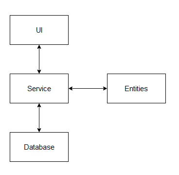
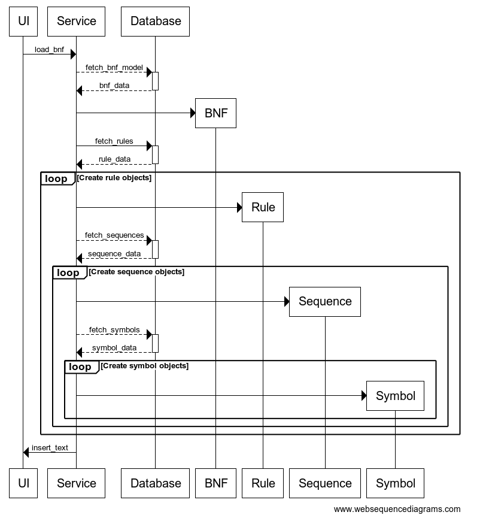

# Arkkitehtuurikuvaus

## Rakenne

Ohjelman ylätason rakenne on kuvattu alla olevassa kuvassa. Ohjelma sisältää käyttöliittymän, jossa hyödyntää BNF-serviceä, mistä on tietokanta yhteys. BNF-service sisältää myös viittauksen BNF-mallin olioon.

## Sovelluslogiikka

Alla olevassa kuvassa on esitetty sovelluksen tämän hetkinen luokkakaavio. Ohjelman sovelluslogiikka sisältää neljä luokkaa: `BNF`, `Rule`, `Sequence` ja `Symbol`

## Toiminallisuudet

### Mallin lataaminen

Alla olevassa kuvassa on esitetty sekvenssikaavio, kun BNF-malli ladataan tietokannasta.

### Mallin tallennus

TODO

### Mallin visualisointi

TODO

## Tietojen tallennus

Tiedot tallennetaan SQL-tietokantaan. Tietokanta alustetaan luokassa `Database` ja se annettaan syötteenä luokalle `Service`. Jokaisella luokalla `BNF`, `Rule`, `Sequence` ja `Symbol` on tietokannassa omat taulunsa.