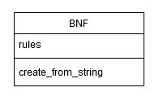

# Arkkitehtuurikuvaus

Alla olevassa kuvassa on esitetty sovelluksen tämän hetkinen luokkakaavio. Ohjelman sovelluslogiikka sisältää yhden luokan, `BNF`, joka sisältää joukon BNF-sääntöjä muuttujassa `rules` ja yhden julkisen yhden julkisen metodin, `create_from_string`.

