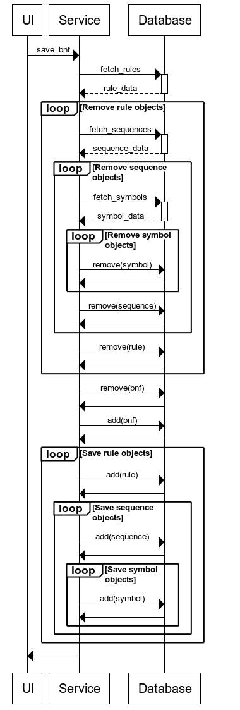

# Arkkitehtuurikuvaus

## Rakenne

Ohjelman ylätason rakenne on kuvattu alla olevassa kuvassa. Ohjelma sisältää käyttöliittymän, joka hyödyntää BNF-serviceä, josta on tietokantayhteys. BNF-service sisältää myös viittauksen BNF-mallin olioon.

## Käyttöliittymä

Käyttöliittymässä on kaksi näkymää, jotka ovat aloitussivu ja visualisointisivu. Aloitussivulta käyttäjä voi aloittaa uuden mallin visualisoimisen tai mallin lataamisen tietokannasta. Kummallakin tavalla käyttäjä siirtyy visualisointisivulle, jossa käyttäjä voi syöttää BNF-mallin mukaisen määrittelyn sille varattuun tekstikenttään, visualisoida määrittelyn ja tallentaa BNF-mallin tietokantaan. Visualisointisivulta käyttäjä pystyy palaamaan takaisin aloitussivulle painamalla paluupainiketta.

Aloitussivusta vastaa luokka [`StartView`](../src/ui/view.py#L11) ja visualisointisivusta luokka [`EditModeView`](../src/ui/view.py#L53), jotka kummatkin perivät luokan [`View`](../src/ui/view.py#L3). Koko käyttöliittymästä vastaa luokka [`UI`](../src/ui/ui.py#L4).

## Sovelluslogiikka

Alla olevassa kuvassa on esitetty sovelluksen luokkakaavio. Ohjelman sovelluslogiikka sisältää neljä luokkaa: [`BNF`](../src/entities/bnf.py#L32), [`Rule`](../src/entities/rule.py#L4), [`Sequence`](../src/entities/sequence.py#L4) ja [`Symbol`](../src/entities/symbol.py#L3). Luokalta `BNF` löytyy seuraavat julkiset metodit:
* `create_from_string`
* `check_unassigned_nonterminals`

Luokat `Rule`, `Sequence` ja `Symbol` sisältävät julkisina vain konstruktorin `__init__` ja `__str__`-metodit.

Lisäksi löytyy luokkaan `BNF` kuulumaton erillinen, mutta vahvasti luokan yhteyteen kuuluva funktio [`check_syntax`](../src/entities/bnf.py#L5), jolla voi tarkistaa BNF-määrittelyn syntaksin oikeellisuuden.

## Toiminallisuudet

### Mallin lataaminen

Alla olevassa kuvassa on esitetty sekvenssikaavio, kun BNF-malli ladataan tietokannasta. Käyttäjä valitsee käyttöliittymästä aiemmin tallennetun mallin, ja painaa painiketta *load model*. Tällöin luokan `Service` instanssissa aloitetaan tallennetun mallin lataaminen tietokannasta. Ensin ladataan tiedot BNF-mallista ja luodaan olio, joka on luokan `BNF` instanssi. Tämän jälkeen ladataan tiedot säännöistä ja luodaan olioita, jotka ovat luokan `Rule` instansseja. Kullekin `Rule`-luokan objektille ladataan tietokannasta tiedot lausekkeista ja luodaan oliot, jotka ovat luokan `Sequence` olioita. Kullekin `Sequence`-luokan oliolle ladataan tiedot tietokannasta symboleista ja luodaan näitä vastaavat oliot, jotka ovat luokan `Symbol` instansseja.

### Mallin tallennus

Alla olevassa kuvassa on esitetty sekvenssikaavio, kun BNF-malli tallennetaan tietokantaan. Käyttäjä painaa käyttöliittymässä painiketta *save drawn model*. Tällöin luokan `Service` instanssissa aloitetaan BNF-mallin tallennus. Jos tietokannasta löytyy malli, jolla on sama id kuin tallennettavalla mallilla, poistetaan tietokannasta malli ja siihen liittyvät tiedot säännöistä, lausekkeista ja symboleista. Tämän jälkeen uusi malli, ja siihen liittyvät säännöt, lausekkeet ja symbolit tallennetaan tietokantaan.

### Mallin visualisointi

Alla olevassa kuvassa on esitetty sekvenssikaavio, kun BNF-malli luodaan. Käyttäjä kirjoittaa käyttöliittymässä BNF-mallin mukaisen määrittelyn sille varattuun tekstikenttään, ja painaa painiketta *draw*. Tällöin BNF-mallin määrittelevä teksti siirtyy käyttöliitymässä luokan `Service` instanssille, joka ensimmäiseksi tarkistaa, onko syntaksi oikein. Jos syntaksi on oikein, luodaan ensin olio, joka on luokan `BNF` instanssi. BNF-olio muodostaa tarvittavat oliot säännöille, jotka ovat luokan `Rule` instansseja, nämä luovat tarvittavat oliot lausekkeille, jotka ovat luokan `Sequence` instansseja, jotka vielä luovat tarvittavat oliot symboleille, jotka ovat luokan `Symbol` instansseja. BNF-olio palautuu lopulta servicelle, ja visualisoidaan käyttöliittymässä.

## Tietojen tallennus

Tiedot tallennetaan SQL-tietokantaan. Tietokanta alustetaan luokassa `Database` ja se annetaan syötteenä luokalle `Service`. Tietojen tallennuksesta, lataamisesta ja poistamisesta huolehtii luokka `Service`, joka välittää käskyt tietokantaluokalle `Database`.

Jokaisella luokalla `BNF`, `Rule`, `Sequence` ja `Symbol` on tietokannassa omat taulunsa. Tietokantaan tallennetaan näistä luokista seuraavat tiedot:

BNF
* id (avain): BNF-mallin id UUID:nä

Rule
* id (avain): Säännön id UUID:nä
* bnf: BNF-mallin UUID, johon sääntö liittyy
* symbol: Symbolin teksti, jolle sääntö on määritetty

Sequence
* id (avain): Lausekkeen id UUID:nä
* rule: Säännön UUID, johon lauseke liittyy

Symbol
* id (avain): Symbolin id UUID:nä
* sequence: Lausekkeen UUID, johon symboli liittyy
* type: symbolin tyyppi
* label: symbolin teksti
