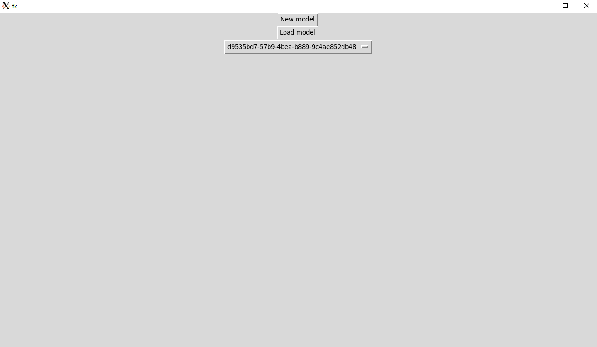
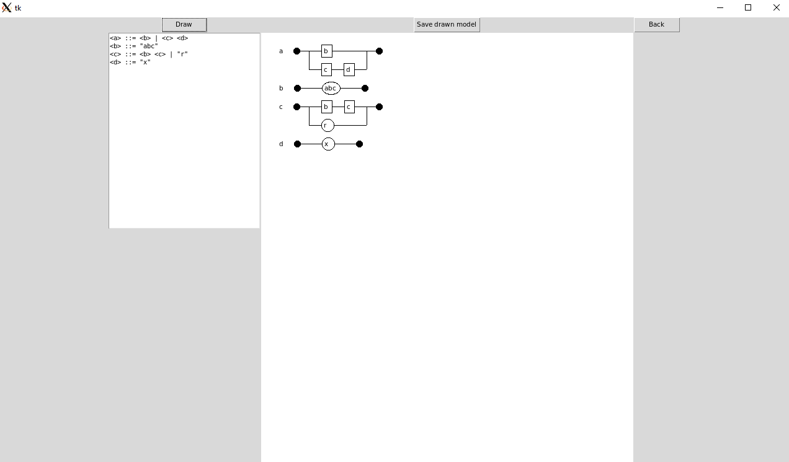

# Käyttöohje

## Ohjelman asennus ja käynnistys
Ohjelman asennus tapahtuu komennolla `poetry install`, jonka jälkeen ohjelman voi suorittaa komennolla `poetry run invoke start`.

### Uuden mallin luominen

Uuden mallin luominen onnistuu painamalla *New model* -painiketta.

Jos tietokannassa on olemassa tallennettuja malleja, uuden mallin luominen onnistuu painamalla alasvetovalikkopainiketta, valitsemalla ladatava malli, ja painamalla *Load model* -painiketta. Jos tietokannassa ei ole tallennettuja malleja, mallin lataus on piilotettu.

### Mallin visualisointi

Mallin visualisointi onnistuu kirjoittamalla BNF-syntaksin mukainen määrittely visualisointitilassa vasempaan tekstikenttään. Piirtäminen onnistuu painamalla painiketta *Draw*, ja visualisoitu malli painamalla *Save drawn model* -painiketta. Ohjelma ilmoittaa virheellisistä syötteistä, sekä varoittaa, mikäli mallissa esiintyy määrittelemättömiä symboleja.

### Syntaksi BNF-mallin kirjoittamiseen

BNF-malli koostuu säännöistä, sääntö koostuu lausekkeesta ja lauseke koostuu symboleista. Symboli voi olla muuttujasymboli tai päätesymboli. Päätesymboli on merkkijono, jonka ympärillä on lainausmerkit. Muuttujasymbolin ympärillä on merkit `<` ja `>`. Lausekkeessa symbolit erotellaan välilyönneillä. Säännössä lausekkeet erotetaan merkkillä `|`, jonka ympärillä on välilyönnit. Jokainen rivi muodostaa yhden säännön, missä säännön määrittävä muuttuja on vasemmalla, jonka jälkeen merkkijono `::=` ympäröitynä välilyönneillä, ja tämän jälkeen säännön lausekkeet.

Esimerkki: Alla oleva malli sisältää säännöt muuttujille `<a>`, `<b>`, `<c>` ja `<d>`. Sääntö `<a>` koostuu kahdesta lausekkeesta, `<b> <c>` ja `<d>`. Sääntö `<b>` koostuu lausekkeesta, joka on merkkijono `abc`. Sääntö `<c>` koostuu lausekkeista `<b> <c>` ja `"r"`. Sääntö `<d>` koostuu lausekkesta, joka on merkkijono `"x"`.

    <a> ::= <b> <c> | <d>
    <b> ::= "abc"
    <c> ::= <b> <c> | "r"
    <d> ::= "x"
    
